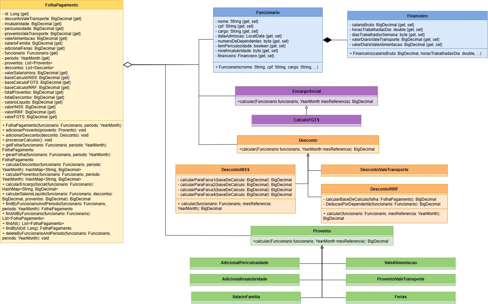
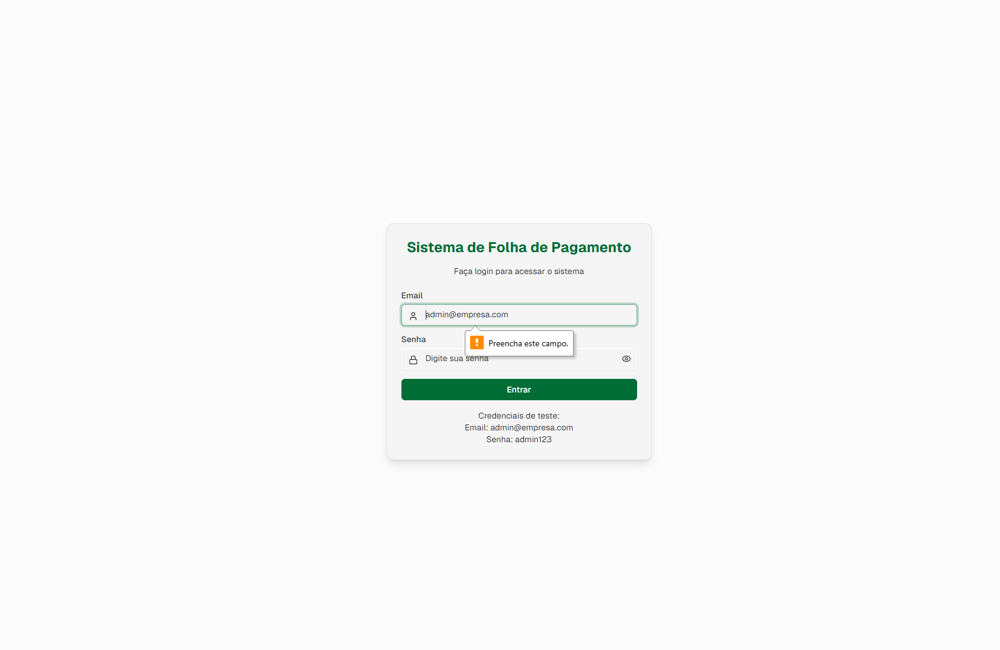
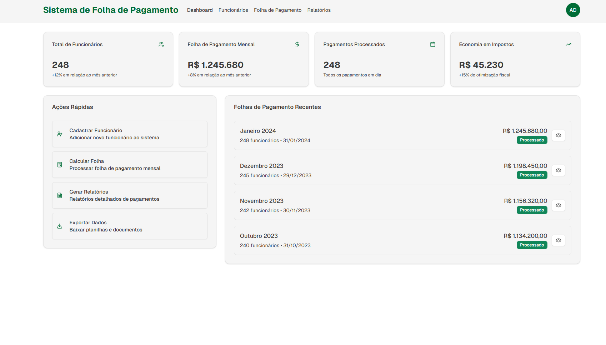
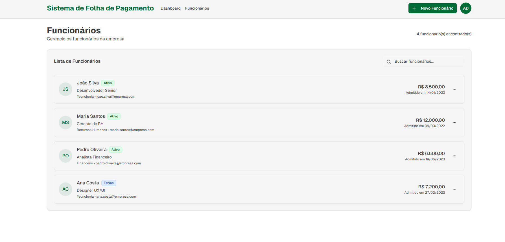
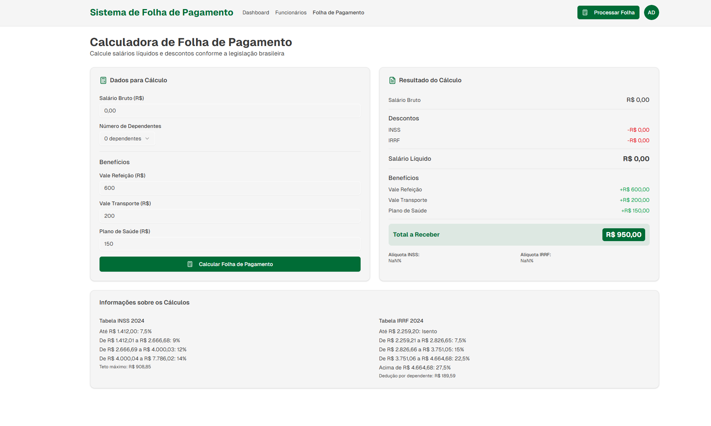
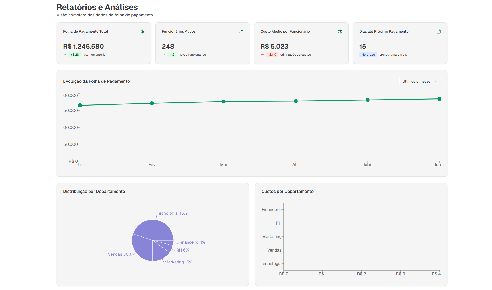
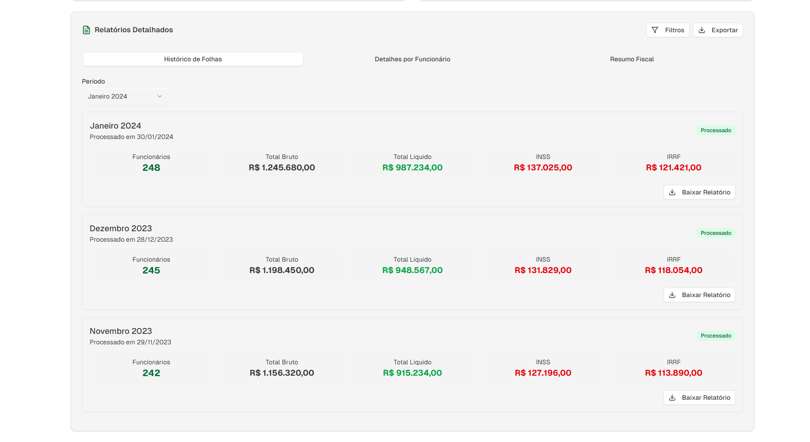

# Gestão de folha de pagamento

## Análise do estudo de caso

O domínio do sistema é o cálculo da folha de pagamento de uma empresa. A folha de pagamento é um documento mensal que detalha as remunerações, encargos e benefícios dos funcionários.

A folha de pagamento possui três propósitos principais:

* Obrigação legal:  É um documento exigido por lei que deve ser emitido mensalmente e arquivado pela empresa por um período mínimo de cinco anos.
* Ferramenta de Gestão: Permite à empresa controlar os custos com funcionários e acompanhar a evolução das remunerações e encargos sociais.
* Transparência para o Funcionário: Serve como um registro para que o colaborador possa verificar se o valor pago está correto e se seus direitos trabalhistas estão sendo respeitados.

O processo de cálculo parte do salário bruto, sobre o qual são aplicados os adicionais e benefícios, e são deduzidos os descontos. O objetivo final do sistema é automatizar essa rotina para apurar o salário líquido e exibir um relatório detalhado.

## Diagrama de Classes



## Modelos das telas do frontend

Tela de login



Tela inicial, indica as principais funcionalidades, mostra as folha de pagamentos recentes e os índices mensais.



Acesso aos funcionários cadastrados, sendo possível pesquisar por nome e ver sobre um funcionário específico.



Visão geral da folha de pagamento, com os benefícios, salário base e descontos.



Acesso aos gráficos e estatísticas do salário mensal de todos os funcionários.




## Casos de teste

| **ID** | **Classe / Funcionalidade**            | **Objetivo**                                           | **Entrada**                                          | **Resultado Esperado**                                 |
| ------ | -------------------------------------- | ------------------------------------------------------ | ---------------------------------------------------- | ------------------------------------------------------ |
| CT01   | **Funcionario**                        | Validar cadastro de funcionário com dados obrigatórios | Nome, CPF, cargo, data admissão, dependentes         | Funcionário criado corretamente                        |
| CT02   | **Financeiro**                         | Calcular salário bruto por hora/dia                    | Salário base, horas trabalhadas, dias úteis          | Salário bruto calculado                                |
| CT03   | **FolhaPagamento**                     | Processar folha com proventos e descontos              | Funcionário, período, lista de proventos e descontos | Folha gerada com salário líquido                       |
| CT04   | **Provento – ValeAlimentacao**         | Validar cálculo do benefício de vale alimentação       | Valor diário e dias trabalhados                      | Valor total de VA calculado                            |
| CT05   | **Provento – AdicionalPericulosidade** | Validar adicional de periculosidade                    | Salário base e percentual adicional                  | Adicional calculado corretamente                       |
| CT06   | **Provento – AdicionalInsalubridade**  | Validar adicional de insalubridade                     | Salário base e nível insalubridade                   | Valor adicional calculado                              |
| CT07   | **Provento – HoraExtra**               | Validar cálculo de hora extra                          | Nº de horas extras, valor hora                       | Valor de horas extras correto                          |
| CT08   | **Provento – Férias**                  | Garantir cálculo proporcional de férias                | Salário base, período aquisitivo                     | Valor de férias calculado                              |
| CT09   | **Provento – Salário Família**         | Validar cálculo do salário família                     | Nº de dependentes                                    | Valor proporcional calculado                           |
| CT10   | **Desconto – INSS**                    | Validar desconto por faixas salariais                  | Salário bruto                                        | Desconto conforme tabela oficial                       |
| CT11   | **Desconto – IRRF**                    | Validar desconto de IRRF                               | Base de cálculo, dependentes                         | Desconto aplicado corretamente                         |
| CT12   | **Desconto – Vale Transporte**         | Validar desconto de VT                                 | Salário bruto e % definido                           | Desconto aplicado corretamente                         |
| CT13   | **Desconto – Advertência**             | Garantir aplicação de desconto por advertência         | Registro de advertência                              | Valor abatido corretamente                             |
| CT14   | **Encargo Social – FGTS**              | Validar cálculo do FGTS                                | Salário bruto                                        | 8% do salário bruto registrado                         |
| CT15   | **Relatorio**                          | Gerar relatório de folha de pagamento                  | Folha processada                                     | Relatório com cabeçalho, proventos, descontos e resumo |

---

## Documentação - Cartões CRC

Os cartões CRC (Classe – Responsabilidade – Colaboração) são uma técnica utilizada no processo de modelagem orientada a objetos.  
Eles ajudam a representar de forma simples e visual as principais responsabilidades de uma classe e como ela se relaciona com outras classes dentro de um sistema.

---

## Cartões CRC

### Funcionário
| **Responsabilidades** | **Colaborações** |
| ---------------------- | ---------------- |
| Armazenar dados pessoais e contratuais (nome, CPF, cargo, salário bruto, dependentes, data de admissão). | Folha de Pagamento (fornece os dados para cálculos). |
| Fornecer informações necessárias para cálculos da folha. | Cálculo Financeiro (usado indiretamente para cálculos). |

---

### Folha de Pagamento
| **Responsabilidades** | **Colaborações** |
| ---------------------- | ---------------- |
| Gerenciar o vínculo com o funcionário. | Funcionário (para obter salário bruto, dependentes etc.). |
| Guardar dados da folha (mês de referência, salário hora, salário líquido). | Cálculo Financeiro (para realizar os cálculos). |
| Gerar relatório consolidado da folha de pagamento. | Provento e Desconto (lista de itens que compõem a folha). |
| Agregar proventos e descontos. | 

---

### Cálculo Financeiro
| **Responsabilidades** | **Colaborações** |
| ---------------------- | ---------------- |
| Calcular salário líquido. | Funcionário (usa seus dados para calcular valores). |
| Calcular salário hora. | Folha de Pagamento (retorna valores para serem exibidos/armazenados). |

---

### Provento (Interface)
| **Responsabilidades** | **Colaborações** |
| ---------------------- | ---------------- |
| Representar um item de ganho na folha (salário base, benefícios, adicionais). | Folha de Pagamento. |
| Armazenar descrição e valor.  | |

**Proventos:**
- Adicional de Periculosidade  
- Adicional de Insalubridade  
- Vale Alimentação
- Vale Transporte
- Salário Família
- Férias

---

### Desconto (Interface)
| **Responsabilidades** | **Colaborações** |
| ---------------------- | ---------------- |
| Representar um item de desconto na folha | Folha de Pagamento. |  
| Armazenar descrição e valor.  | |

**Descontos:**
- Desconto INSS  
- Desconto IRFF
- Vale Transporte

---

### Encargo Social (Interface)
| **Responsabilidades** | **Colaborações** |
| ---------------------- | ---------------- |
| Representar um item de encargo social na folha | Folha de Pagamento. |  
| Armazenar descrição e valor.  | |

**Encargos Sociais:**
- FGTS

---

---

## Princípios SOLID

O projeto segue os princípios **SOLID** para maximizar a flexibilidade, especialmente no tratamento de regras fiscais variáveis:

* **SRP (Responsabilidade Única):** As classes de `Provento` e `Desconto` são responsáveis por sua própria regra específica de cálculo.
* **OCP (Aberto/Fechado):** O sistema deve ser aberto à extensão, mas fechado à modificação. Novas regras fiscais ou benefícios são adicionadas implementando as interfaces `Provento` ou `Desconto`, sem alterar o código do `FolhaPagamentoService`.
* **DIP (Inversão de Dependência):** O `Service` depende de abstrações (Interfaces `Provento` e `Desconto`), não de implementações concretas, permitindo fácil substituição.

### Validação e Tipagem em Java
Utilizamos técnicas específicas de Java para garantir a integridade dos dados:

| Conceito | Aplicação no Projeto | Dependência |
| :--- | :--- | :--- |
| **Validation** | Utilização da especificação Bean Validation (JSR 380) para garantir que os dados de entrada (DTOs) e entidades sejam válidos (Ex: `@NotNull`, `@CPF`). | `spring-boot-starter-validation` |
| **Unboxing** | Uso de classes *Wrapper* (`Double`, `Integer`, `BigDecimal`) em vez de tipos primitivos nos modelos de dados. Isso permite valores `null` no banco de dados e maior robustez em operações financeiras de alta precisão. | Padrão Java |

## Dependências (Maven)

```SpringBoot Starter Web```

```Spring Boot DevTools```

```Spring Boot Starter Test```

```Lombok```

```Spring Boot Starter Validation```

```Gson```

```Spring Boot Starter Data JPA```

```PostgreSQL Driver```

```SpringDoc OpenAPI (Swagger UI)```

```Spring Boot Starter Security```

```Spring Security Test```

```Auth0 Java JWT```
    </dependency>
</dependencies>
